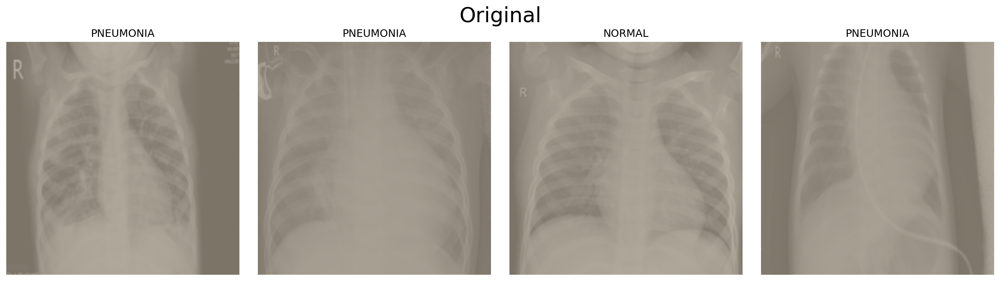
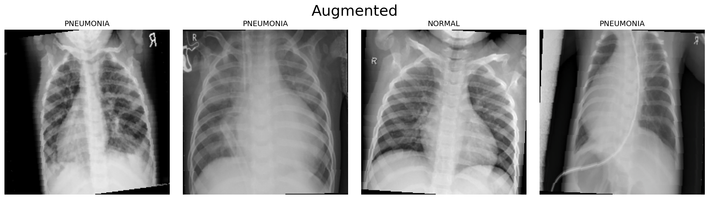
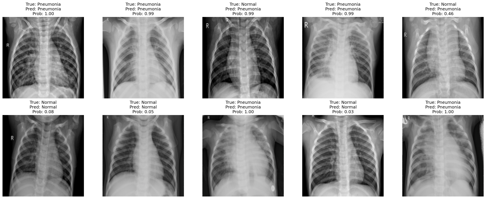

# Pneumonia Detection with ResNet18 + GradCAM
**흉부 X-ray 이미지 기반 폐렴 이진 분류 — 의료 AI 설계 관점의 딥러닝 프로젝트**

---

## 핵심 문제의식

X-ray 판독에서 **폐렴 환자를 정상으로 오진(FN)**하는 것은 치료 지연으로 이어지는 임상적으로 치명적인 오류다.  
따라서 이 프로젝트는 단순 Accuracy 최적화가 아닌, **FN 최소화(Recall 최대화)** 를 설계 철학의 출발점으로 삼았다.

> **모델 선택 기준 → F1** (Ablation Study 단계: 편향 없는 전반 성능 비교)  
> **임계값 선택 기준 → Recall** (평가 단계: 폐렴 미검출 최소화가 임상적 우선순위)

---

## 최종 성능

| Threshold | Accuracy | Precision | Recall | F1 Score | AUROC |
|-----------|----------|-----------|--------|----------|-------|
| 0.3 | 87.5% | 83.9% | **98.97%** | 90.82% | 92.49% |
| 0.5 | 89.74% | 89.25% | 96.41% | 92.70% | 92.49% |
| 0.7 | 90.22% | 93.03% | 92.56% | 92.80% | 92.49% |

**채택 임계값: 0.3** — Recall 기준 최적 (FN 최소화 우선)  
AUROC 0.9249 — 임계값 무관하게 모델 자체의 판별력이 임상적으로 유의미한 수준(≥0.90)

---

## 모델 아키텍처

```
Input (224×224 RGB)
    ↓
[pre_conv block]       ← X-ray 특화 초기 특징 추출 (채널: 3 → 16 → 3)
    ↓                     자연 이미지에 최적화된 ResNet 앞단에 의료 도메인 적응 레이어 추가
[ResNet18 Backbone]    ← ImageNet 사전학습 가중치 (전이학습)
    ↓
[FC Head]
  Linear(512→128) + BatchNorm1d + ReLU + Dropout(0.5)
  Linear(128→1)
    ↓
BCEWithLogitsLoss      ← sigmoid + BCE를 수치 안정적으로 결합
```

### pre_conv 블록을 설계한 이유

흉부 X-ray는 자연 이미지와 달리 **저대비·음영 기반 패턴**이 핵심 정보다. ResNet의 초기 레이어는 ImageNet 기반 엣지·색상 필터에 편향되어 있어, X-ray 고유의 밀도 차이를 충분히 포착하지 못할 수 있다. `pre_conv(3→16→3)` 블록은 이를 보완하기 위해 ResNet 입력 형식(3채널)을 유지하면서 X-ray 특화 표현을 선학습하는 구조다.

---

## Ablation Study — 파라미터 축소 실험

FC Head 크기 / Dropout / Backbone freeze 여부를 실험 축으로 설정, 최적 구조를 탐색했다.

| 설정 | FC 크기 | Dropout | Freeze | Val Loss | Recall | F1 | AUROC |
|------|---------|---------|--------|----------|--------|-----|-------|
| **baseline** | 512→128 | 0.5 | 없음 | **0.0276** | **99.49%** | **90.23%** | 92.49% |
| fc64 | 512→64 | 0.5 | 없음 | 0.0874 | 99.74% | 88.21% | 90.02% |
| freeze_layer1-3 | 512→128 | 0.5 | layer1~3 | 0.3828 | 98.97% | 90.08% | **95.64%** |

→ **baseline** 선정 (F1 기준 최우수 + val_loss 최저로 일반화 신뢰도 가장 높음)

- `fc64`: 파라미터를 줄였으나 val_loss 3배 이상 — 과적합 억제보다 표현력 손실이 더 컸음
- `freeze_layer1-3`: AUROC는 최고지만 val_loss 0.38로 학습이 불안정 — backbone의 의료 도메인 적응이 필요함을 시사


---

## 평가 — 임계값별 지표 비교

임계값을 0.3 / 0.5 / 0.7로 변경하며 Precision-Recall 트레이드오프를 직접 확인했다.


**혼동행렬** (채택 임계값 0.3 기준)


FN(폐렴 미진단): 약 4건 / FP(과진단): 73건  
→ 과진단은 추가 검사로 대응 가능하지만, 미진단은 치료 기회 자체를 놓치는 오류

---

## GradCAM — 모델 판단 근거의 임상적 검증

성능 수치만으로는 "모델이 올바른 이유로 맞혔는지" 알 수 없다.  
GradCAM으로 모델의 attention이 실제로 **폐 실질(lung parenchyma) 영역**에 집중하는지 검증했다.


| 케이스 | 기대 패턴 | 판정 기준 |
|--------|-----------|-----------|
| 폐렴 | 폐 하엽·중엽 실질에 집중 | Focused on Lung Parenchyma (Valid) |
| 정상 | 전반적 분산 | Diffused Activation |
| 주의 | 뼈·기기 아티팩트에 집중 | Focused on Border Area (Check Required) |

**pre_conv 필터 시각화** — 학습된 16개 필터가 명확한 색상 대비와 방향성 패턴을 가지고 있어, X-ray 내 해부학적 경계 탐지 능력이 형성됐음을 확인


---

## 데이터 전처리 — 증강 전후 비교




RandomHorizontalFlip + RandomRotation 적용. 수평 반전은 좌우폐 대칭성이 있는 흉부 X-ray에서 유효한 증강이며, 과도한 회전은 의학적 구도를 왜곡할 수 있어 10도로 제한했다.

---

## 추론 샘플 시각화



---

## 프로젝트 구조

```
Pneumonia-Detection-Xray-CNN/
├── notebooks/
│   └── project_pneumonia_diagnosis_final.ipynb   # 전체 실험 노트북 (EDA → 학습 → 평가 → GradCAM)
├── src/
│   ├── dataset.py      # ChestXRayDataset + DataLoader 팩토리
│   ├── model.py        # PneumoniaResNet (pre_conv + ResNet18 + FC Head)
│   ├── train.py        # EarlyStopping + ReduceLROnPlateau 학습 루프
│   ├── experiment.py   # Ablation Study 실험 실행
│   ├── evaluate.py     # 임계값별 메트릭 + 혼동행렬 + ROC
│   └── gradcam.py      # GradCAM + 임상 유효성 검증 시각화
├── outputs/
│   ├── figures/        # 모든 시각화 결과물
│   └── models/         # 저장된 모델 가중치
├── docs/
│   └── analysis_report.md   # 상세 분석 보고서
├── data/
│   └── README.md       # 데이터 출처 및 구조 안내
├── requirements.txt
└── .gitignore
```

---

## 실행 방법

```bash
pip install -r requirements.txt

# Kaggle 데이터 다운로드
kaggle datasets download paultimothymooney/chest-xray-pneumonia
unzip chest-xray-pneumonia.zip -d data/

# notebooks/ 의 ipynb를 순서대로 실행하거나,
# src/ 모듈을 직접 import하여 사용
```

---

## 기술 스택

`Python` `PyTorch` `torchvision` `ResNet18` `GradCAM` `scikit-learn` `matplotlib` `seaborn` `pandas`

---

## 데이터 출처

[Kaggle: Chest X-Ray Images (Pneumonia)](https://www.kaggle.com/datasets/paultimothymooney/chest-xray-pneumonia)  
Train 5,216장 / Val 16장 / Test 624장 | NORMAL : PNEUMONIA ≈ 1 : 3
