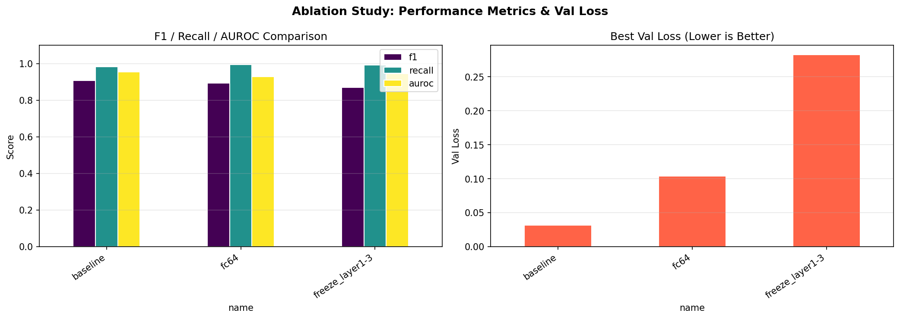
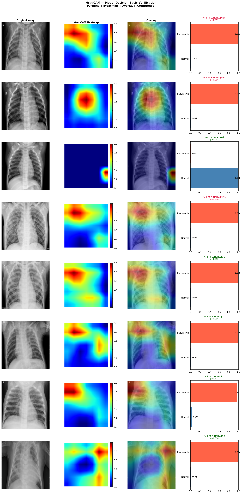

# Pneumonia Detection — ResNet18 + GradCAM
흉부 X-ray 기반 폐렴 이진 분류 | 의료 AI 설계 관점의 딥러닝 프로젝트

---

## 이 프로젝트가 특별한 이유

단순한 ResNet fine-tuning이 아닌, **의료 도메인 문제를 설계 단계부터 반영**한 세 가지 포인트.

**1. pre_conv block — X-ray 특화 전처리 레이어 직접 설계**  
ResNet18 앞단에 `Conv2d(3→16→3)` 블록 추가. 자연 이미지 필터에 편향된 ResNet이 흉부 X-ray의 저대비·음영 패턴을 포착하도록 도메인 적응 레이어를 수동 설계. ResNet 입력 형식(3채널) 유지로 사전학습 가중치와 완전 호환.

**2. Ablation Study — 구조 선택의 근거를 실험으로 증명**  
FC 크기 / Backbone freeze 전략을 동일 조건에서 실험 비교. "왜 이 구조를 선택했는가"에 대한 답을 수치로 제시.

**3. F1 → Recall 2단계 지표 전략 — 임상 논리를 평가 설계에 반영**  
모델 선택은 F1 기준(편향 없는 전반 성능), 임계값 선택은 Recall 기준(FN 최소화 우선). 미검출(FN)이 과검출(FP)보다 치명적인 의료 특성을 평가 로직에 직접 적용.

---

## 최종 성능

| Threshold | Accuracy | Precision | Recall | F1 | AUROC |
|-----------|----------|-----------|--------|----|-------|
| **0.3** ← 채택 | 85.58% | 81.78% | **98.97%** | 89.56% | **95.36%** |
| 0.5 | 87.50% | 84.36% | 98.21% | 90.76% | 95.36% |
| 0.7 | 88.62% | 85.84% | 97.95% | 91.47% | 95.36% |

Recall 기준 최적 임계값 0.3 채택 — 폐렴 390명 중 **387명 탐지, FN 3건**  
AUROC 95.36% — 임계값 무관한 모델 판별력, 임상적으로 유의미한 수준(≥0.90)

---

## 모델 아키텍처

```
Input (224×224 RGB)
    ↓
[pre_conv]    Conv2d(3→16→3) + BN + ReLU × 2   ← X-ray 특화 도메인 적응
    ↓
[ResNet18]    ImageNet 사전학습 backbone
    ↓
[FC Head]     Linear(512→128) + BN + ReLU + Dropout(0.5) + Linear(128→1)
    ↓
BCEWithLogitsLoss
```

---

## Ablation Study 결과

| 설정 | Val Loss | F1 | Recall | AUROC | 비고 |
|------|----------|----|--------|-------|------|
| **baseline** | **0.0315** | **0.9076** | 0.9821 | **0.9536** | 선정 |
| fc64 | 0.1041 | 0.8940 | 0.9949 | 0.9283 | val_loss 3배↑ |
| freeze_layer1-3 | 0.2824 | 0.8706 | 0.9923 | 0.9451 | ep8 조기종료 |



baseline 선정: F1 최고 + val_loss 최저 → 일반화 신뢰도 가장 높음  
freeze_layer1-3: AUROC는 높지만 val_loss 0.28로 불안정 — backbone 학습 없이는 X-ray 도메인 적응에 한계

---

## GradCAM — 모델이 올바른 근거로 판단하는지 검증

성능 수치만으로는 "왜 맞혔는지" 알 수 없음. GradCAM으로 모델 attention이 **폐 실질(lung parenchyma)** 에 집중하는지 임상 기준으로 자동 판정.



폐 영역 vs 경계 영역의 activation 비율을 정량 계산해 `Focused on Lung Parenchyma / Diffused / Border` 3단계로 자동 분류. 단순 시각화가 아닌 **정량적 유효성 검증**까지 구현.

---

## 프로젝트 구조

```
├── notebooks/project_pneumonia_diagnosis_final.ipynb
├── src/
│   ├── model.py        # PneumoniaResNet (pre_conv + ResNet18)
│   ├── train.py        # EarlyStopping + ReduceLROnPlateau
│   ├── experiment.py   # Ablation Study
│   ├── evaluate.py     # 임계값별 메트릭 + 혼동행렬
│   ├── gradcam.py      # GradCAM + 임상 유효성 자동 판정
│   └── dataset.py      # ChestXRayDataset + transforms
├── outputs/figures/    # 모든 시각화 결과
├── docs/analysis_report.md
└── data/README.md
```

**Tech Stack** `Python` `PyTorch` `ResNet18` `GradCAM` `scikit-learn` `matplotlib` `pandas`

**Data** [Kaggle Chest X-Ray Images (Pneumonia)](https://www.kaggle.com/datasets/paultimothymooney/chest-xray-pneumonia) — Train 5,216 / Val 16 / Test 624
