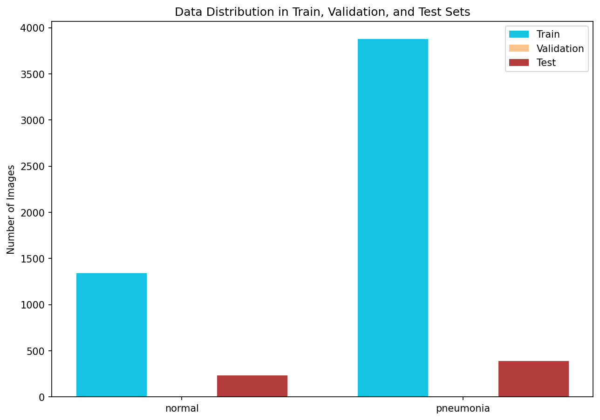
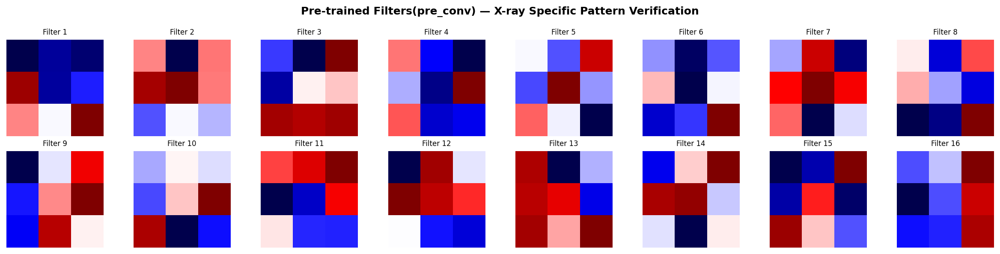
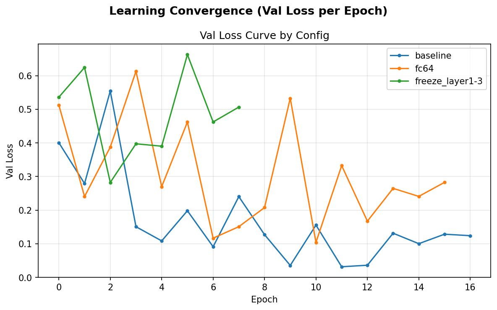
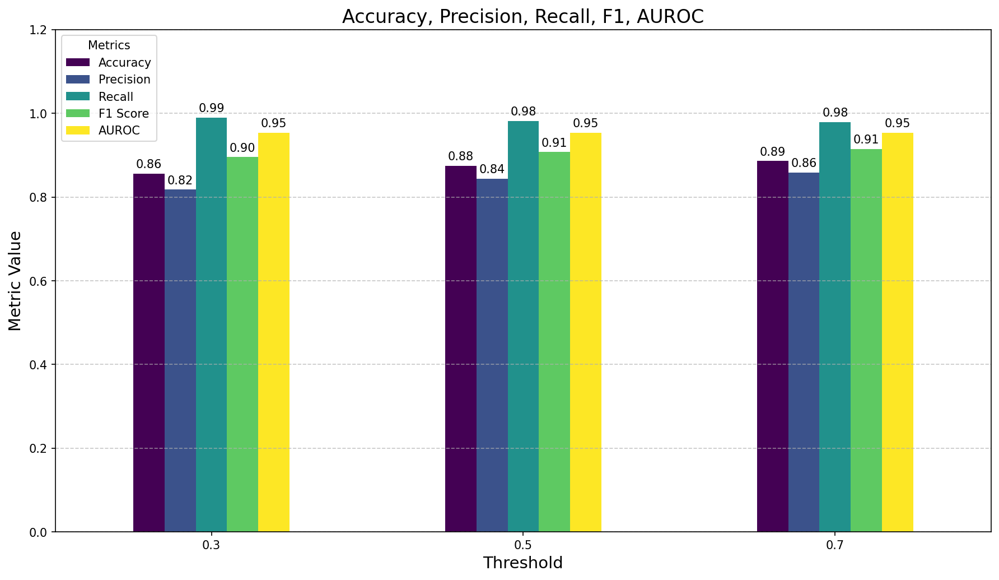
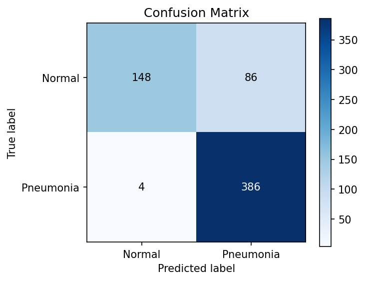

# Pneumonia Detection with ResNet18 + GradCAM
## 분석 리포트

---

## 1. 배경 — 왜 Accuracy가 아닌 Recall인가

흉부 X-ray 판독에서 폐렴을 정상으로 오진(FN)하는 것은 치료 기회 자체를 박탈하는 치명적 오류다. <br>
반면 과검출(FP)은 추가 검사로 대응 가능하다. <br>
이 비대칭성이 이 프로젝트의 모든 설계 결정의 출발점이다.

| 평가 단계 | 기준 지표 | 이유 |
|-----------|-----------|------|
| Ablation — 모델 선택 | **F1** | Recall만 보면 무조건 폐렴으로 예측하는 편향 모델이 유리해짐. F1은 Precision·Recall 균형을 동시에 요구 |
| 임계값 선택 | **Recall** | 모델 확정 후에는 FN 최소화가 임상적 우선순위 |
| 판별력 확인 | **AUROC** | 임계값 무관한 모델 자체의 분리 능력 |

---

## 2. 데이터 — 클래스 불균형 인지 및 대응

| 분할 | Normal | Pneumonia | 합계 |
|------|--------|-----------|------|
| Train | 1,341 | 3,875 | 5,216 |
| Val | 8 | 8 | 16 |
| Test | 234 | 390 | 624 |

폐렴이 정상보다 약 3배 많은 불균형 구조. 대응 전략: 학습 시 RandomHorizontalFlip + RandomRotation 증강, 평가 시 F1/Recall 중심 지표 설계.



Val set이 16장(8+8)으로 극히 작은 것은 EarlyStopping 신뢰도의 한계로, 결론부에서 명시.

---

## 3. 모델 설계 — pre_conv block

### 왜 추가했는가

ResNet18의 초기 conv 레이어는 ImageNet(자연 이미지) 기반 엣지·색상 필터에 편향되어 있다. <br>
흉부 X-ray는 저대비·음영 중심의 패턴으로 구성되어, 이 간극을 좁히는 도메인 적응 레이어가 필요했다.

### 구조

```
Input (224×224 RGB)
    ↓
[pre_conv]    Conv2d(3→16→3) + BatchNorm2d + ReLU × 2
    ↓           → ResNet 입력 형식(3채널) 유지 → 사전학습 가중치 완전 호환
[ResNet18]    ImageNet 사전학습 backbone
    ↓
[FC Head]     Linear(512→128) + BatchNorm1d + ReLU + Dropout(0.5) + Linear(128→1)
    ↓
BCEWithLogitsLoss   (sigmoid + BCE 수치 안정 결합)
```

학습된 16개 pre_conv 필터를 시각화하면 각기 다른 방향성·대비 패턴이 확인되어, 단순 파라미터 추가가 아닌 **실제 X-ray 특화 표현 학습**이 이루어졌음을 방증.



---

## 4. 학습 설정

| 항목 | 설정 | 설계 근거 |
|------|------|-----------|
| Optimizer | Adam, lr=0.0001 | 전이학습에서 작은 LR로 사전학습 가중치 보존 |
| Loss | BCEWithLogitsLoss | sigmoid + BCE 수치 안정 결합, 이진 분류 표준 |
| EarlyStopping | patience=5, val_loss 기준 | 과적합 방지 + best 가중치 자동 복원 |
| LR Scheduler | ReduceLROnPlateau (patience=2, factor=0.5) | val_loss 정체 시 LR 단계적 감소 |
| Max Epoch | 20 | 전이학습 + EarlyStopping 조합으로 충분 |

---

## 5. Ablation Study — 구조 선택의 근거

FC 크기 / Backbone freeze 전략을 동일 조건에서 비교해 최적 구조를 탐색.

| 설정 | Val Loss | Accuracy | Recall | F1 | AUROC | 종료 epoch |
|------|----------|----------|--------|----|-------|------------|
| **baseline** | **0.0315** | 87.50% | 98.21% | **90.76%** | **95.36%** | 17 (조기종료) |
| fc64 | 0.1041 | 85.26% | **99.49%** | 89.40% | 92.83% | 16 (조기종료) |
| freeze_layer1-3 | 0.2824 | 81.57% | 99.23% | 87.06% | 94.51% | **8** (조기종료) |




**baseline 선정 (F1 기준)**

- **fc64**: Recall은 높지만 val_loss 0.10으로 3배 이상 높음. <br>
            파라미터 절감이 일반화 개선이 아닌 표현력 손실로 이어진 케이스.
- **freeze_layer1-3**: AUROC는 준수하지만 ep8에서 조기종료, val_loss 0.28로 학습 불안정. <br>
                      backbone 초기 레이어를 고정하면 X-ray 도메인 특화 표현 학습에 제약이 생김을 시사.

---

## 6. 임계값 최적화 — Precision-Recall 트레이드오프 직접 확인

임계값을 0.3 / 0.5 / 0.7로 변경하며 각 지표의 변화를 측정.

| Threshold | Accuracy | Precision | Recall | F1 | AUROC |
|-----------|----------|-----------|--------|----|-------|
| **0.3** ← 채택 | 85.58% | 81.78% | **98.97%** | 89.56% | **95.36%** |
| 0.5 | 87.50% | 84.36% | 98.21% | 90.76% | 95.36% |
| 0.7 | 88.62% | 85.84% | 97.95% | 91.47% | 95.36% |



임계값을 낮출수록 Recall↑ Precision↓ — Precision-Recall 트레이드오프의 전형적 패턴. 
**Recall 최대화 기준으로 0.3 채택.**

---

## 7. 최종 평가 — 혼동행렬 해석



임계값 0.3 기준:
- **FN (폐렴 미진단)**: 4건 — 폐렴 390명 중 386명 탐지 (Recall 98.97%)
- **FP (과진단)**: 약 86건 — 의사 최종 확인에서 필터링 가능

FP 증가는 임상적으로 수용 가능한 트레이드오프. 
FN이 치료 기회 자체를 박탈한다면, FP는 추가 검사 비용 증가에 그침.

---

## 8. GradCAM — 모델 판단 근거의 임상적 검증

성능 지표 외에 **"모델이 올바른 근거로 판단하는가"** 를 검증하기 위해 GradCAM 구현.


각 케이스에서 Original X-ray / GradCAM Heatmap / Overlay / Confidence 4컬럼으로 시각화.<br>
폐렴 케이스에서 heatmap이 폐 실질 영역에 집중하는지, 정상 케이스에서 분산되는지를 육안으로 확인 가능.

코드 내부에는 폐 중앙 영역 vs 경계 영역의 activation 비율을 정량 계산해<br>
`Focused on Lung Parenchyma / Diffused / Border` 3단계로 자동 판정하는 로직을 구현했으나,<br>
현재 시각화 출력에는 미반영 상태 — 향후 개선 과제로 남김.

오분류(MISS) 케이스에서도 heatmap이 폐 영역을 보고 있다면,<br>
시각적으로 구분이 어려운 경계 케이스(borderline case)로 해석.<br>
오분류 자체보다 **attention의 위치**가 임상적 신뢰성 판단의 기준.

**GradCAM의 한계**: 입력마다 기울기가 달라 활성화 위치가 가변적.<br>
시각적 설명과 모델 내부 의사결정이 완전히 일치하지 않을 수 있음.<br>
신뢰성 검증의 보조 도구로 활용.

---

## 9. 성과 및 한계

**성과**
- AUROC 95.36% — 임계값 무관 판별력, 임상적으로 유의미한 수준 달성
- Recall 98.97% (threshold=0.3) — 폐렴 390명 중 386명 탐지, FN 4건
- Ablation Study로 최적 구조 선정, val_loss 0.0315의 안정적 일반화 확보
- GradCAM 정량 판정으로 모델이 폐 실질 영역을 근거로 판단함을 검증

**한계**
- Val set 16장 — val_loss 기반 EarlyStopping의 통계적 신뢰도에 한계
- 단일 출처 데이터 — 다기관 임상 데이터 일반화 검증 미실시
- 세균성/바이러스성 폐렴 미구분 — 세분류 레이블 없음
- 실제 임상 배포 시 전문의 레이블링 데이터 기반 추가 검증 필요
